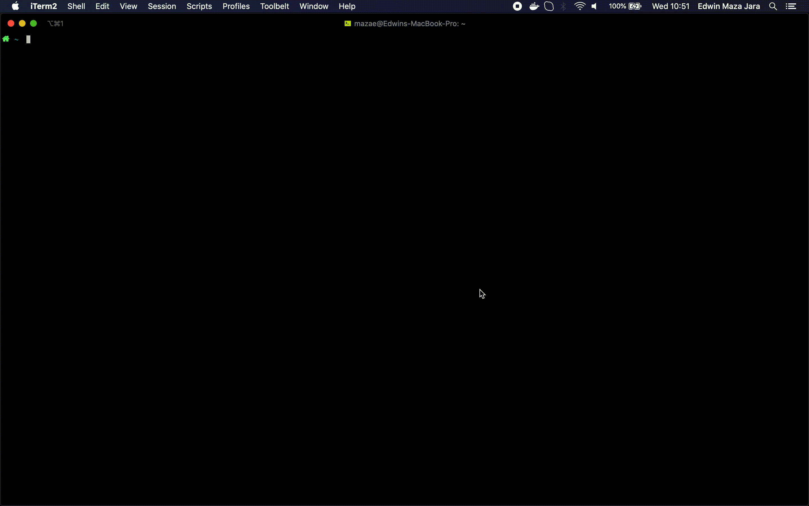

### maza

  

maza is a minimal [oh-my-zsh](https://ohmyz.sh) theme.

### Fonts

Maza does require custom fonts but can take advantage of them if they are available.
It works well with [Nerd Fonts](https://github.com/ryanoasis/nerd-fonts),
[Source Code Pro](https://github.com/adobe-fonts/source-code-pro),
[Font Awesome](https://fontawesome.com/), [Powerline](https://github.com/powerline/fonts), and even
the default system fonts. The full choice of style options is available only when using
[Nerd Fonts](https://github.com/ryanoasis/nerd-fonts).

### Recommended: Meslo Nerd Font

Download these ttf files:
- [MesloLGS NF Regular.ttf](https://github.com/romkatv/dotfiles-public/raw/master/.local/share/fonts/NerdFonts/MesloLGS%20NF%20Regular.ttf)
- [MesloLGS NF Bold.ttf](https://github.com/romkatv/dotfiles-public/raw/master/.local/share/fonts/NerdFonts/MesloLGS%20NF%20Bold.ttf)
- [MesloLGS NF Italic.ttf](https://github.com/romkatv/dotfiles-public/raw/master/.local/share/fonts/NerdFonts/MesloLGS%20NF%20Italic.ttf)
- [MesloLGS NF Bold Italic.ttf](https://github.com/romkatv/dotfiles-public/raw/master/.local/share/fonts/NerdFonts/MesloLGS%20NF%20Bold%20Italic.ttf)
- [SourceCodePro for Powerline Regular.ttf](https://github.com/Falkor/dotfiles/blob/master/fonts/SourceCodePro+Powerline+Awesome+Regular.ttf?raw=true)

### For VSC Terminal

Edit file setting.json and add:

`"terminal.integrated.fontFamily": "'Meslo LG S for Powerline', 'SourceCodePro+Powerline+Awesome Regular'"`

### Installation

1. `mkdir $ZSH_CUSTOM/themes` _You can skip this command if the directory exists already_
2. `wget -O $ZSH_CUSTOM/themes/maza.zsh-theme https://raw.githubusercontent.com/eamazaj/maza-theme/master/maza.zsh-theme`
3. `vim ~/.zshrc`
4. Set `ZSH_THEME="maza"`
